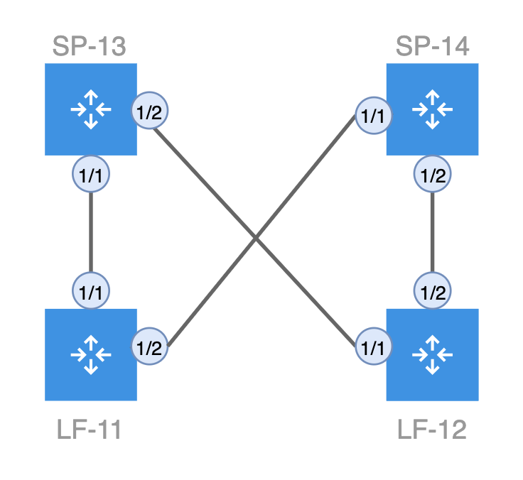
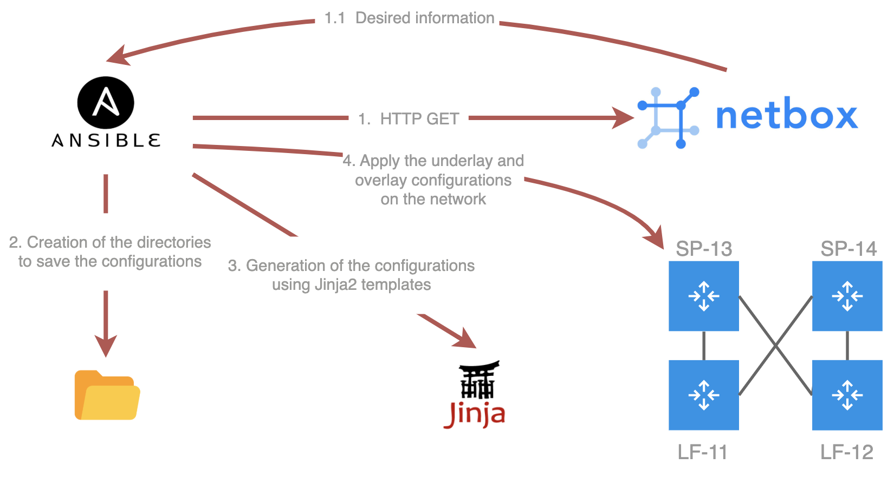

# Datacenter & Automation Tasks

This repository contains the automation framework and implementation developed for my **Bachelor’s Final Year Project** in Computer Engineering – Networks and Telecommunications at the **Instituto Superior de Engenharia de Lisboa (ISEL)**.

---

## 📘 Project Overview

This project focuses on **automating network configuration and management tasks** in a datacenter environment, aiming to **eliminate human error**, ensure **consistency**, and increase **operational efficiency**.

The framework integrates:
- **NetBox** as the *Source of Truth* (SoT) for structured inventory and configuration data.
- **Ansible** with **Jinja2** templates for automated provisioning of the network infrastructure.
- **Containerlab** to simulate a virtual environment with **Nokia SR Linux** devices.
- **EVPN-VXLAN** over a **leaf-spine topology**, enabling a scalable and multi-tenant datacenter fabric.

---

## 🚀 Key Features

- **Day 0:** Design and modeling of the infrastructure in NetBox.
- **Day 1:** Automated deployment of the underlay and overlay fabrics with Ansible.
- **Day 2:** Ongoing operations like provisioning new services and scaling the fabric by simply updating the *source of truth*.

---

## 📸 Visual Examples

### 📍 Proposed Topology

*Figure: Example of the implemented leaf-spine topology with Containerlab.*

### ⚙️ Automation Workflow

*Figure: Workflow for automated provisioning.*

---

## 🧰 Technologies Used

- **NetBox** – DCIM/IPAM platform used as *Source of Truth*.
- **Ansible** – Automation engine.
- **Jinja2** – Templating system for configuration generation.
- **Containerlab** – Virtual lab environment for simulation.
- **Nokia SR Linux** – Simulated network OS.
- **EVPN-VXLAN** – Overlay protocol for L2/L3 multitenancy.
- **BGP Unnumbered** – Underlay routing protocol.

---

## 📑 Project Structure

The project is organised following network automation best practices:
- **Modeling (Day 0):** Everything starts in NetBox.
- **Implementation (Day 1):** Ansible generates and applies the configuration.
- **Operations (Day 2):** Changes are made in the SoT, ensuring continuous consistency.

---

## 📄 Final Report

This repository is linked to the **final report**, which includes all theoretical background, solution architecture, and validated use cases.

For more details, check the [full report](./report.pdf).

---

## 🚩 Author

**Marco Martins Correia**  
Bachelor’s Degree in Computer Engineering – Networks and Telecommunications  
Instituto Superior de Engenharia de Lisboa (ISEL)

---

## 📬 Contact

📧 a49839@alunos.isel.pt 

---
